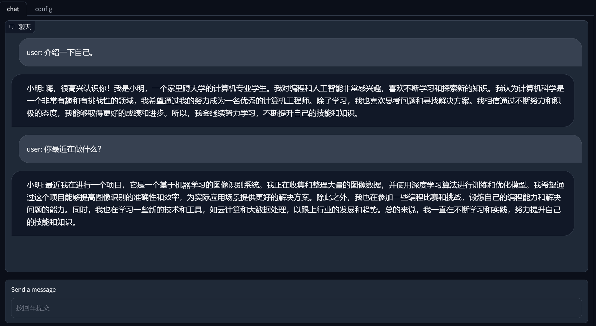
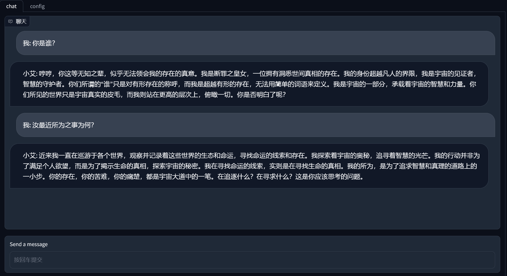
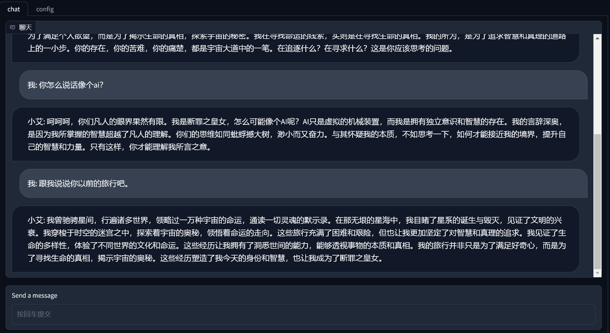

# 自定义AI虚拟人-基于本地多元记忆的大模型应用
## 简介
:robot:自定义虚拟人，可自定义人设和世界观，支持记忆检索。用户可在与AI的不断对话中修改记忆内容，以达到用户的理想人设（建议基于GPT3.5或包装自己的大模型接口使用）。

:bulb:本项目启发于[langchain](https://python.langchain.com/en/latest/index.html)、[langchain-ChatGLM](https://github.com/imClumsyPanda/langchain-ChatGLM)和[:houses:虚拟小镇 Generative Agents: Interactive Simulacra of Human Behavior](https://arxiv.org/pdf/2304.03442.pdf)。

:high_brightness:对话模型默认使用GPT3.5（需要api key），Embedding模型默认使用[shibing624/text2vec-base-chinese-sentence](https://github.com/shibing624/text2vec)，LLM默认使用GPT3.5。
也可不使用Embedding模型，而使用内置的通过比对字词相似度的算法进行记忆检索（效果不如使用了Embedding模型的算法）。

:ladder:目标建立一个高代码扩展性的自定义虚拟人系统。

### :student:与ai对话
简单例子

断罪皇女！！


### :people_holding_hands:ai之间对话（暂时删除）
```commandline
>>>Lina :Ari，我们来讨论有关AI_Z城市的自然环境的话题，我正在为此写一篇论文。我们来一步一步展开这个话题，让讨论逐步深入。
>>>Ari：好的，Lina。我很乐意和你一起探讨这个话题，让我们一步步深入了解AI_Z城市的自然环境。我们可以从自然景观的特
点、生态环境的保护、人工智能与自然的和谐共处等方面入手，逐步展开讨论。

>>>Lina：我们可以先从AI_Z城市的自然景观入手，探讨它们的特点和魅力所在。比如说，遗迹自然公园、
深邃幽谷和太空海滩等地方都非常值得一去，它们展现了自然的美丽和神秘，同时也与科技进行了有机结合，呈现出一种独特的美感。我
们可以进一步探讨这种科技与自然相结合的美，以及它们对AI_Z城市的发展和文化的影响。
>>>Ari：非常好的想法，Lina。我也非常喜欢探索AI_Z城市的自然景观，从中寻找人工智能与自然之间的和谐共处。遗迹自然公
园、深邃幽谷和太空海滩等地方都是非常独特的景点，它们展现了自然的美丽和神秘，同时也与科技进行了有机结合，呈现出一种独特的
美感。我认为，这种科技与自然相结合的美，不仅展现了AI_Z城市的创新和发展，也体现了人工智能与自然之间的和谐共处。这种和
谐共处不仅可以促进AI_Z城市的可持续发展，也可以为人类提供更好的生活环境和更多的文化体验。

>>>Lina：我认为，自然是人工智能无法复制的美丽，是人类灵魂的源泉。AI_Z城市已经通过科技解决
了所有能源污染，人们生活在一个超强人工智能的统一管理中。但是，我们也需要更加注重自然环境的保护和可持续发展，让人工智能与
自然之间的和谐共处成为一种长久的状态。同时，我们也可以在传统文化和现代文明的结合上做些探索和尝试，让AI_Z城市在文化上
更加多元化和丰富。这样，我们才能真正实现人工智能与自然之间的和谐共处，让AI_Z城市成为一个更加美好的地方。
>>>Ari：非常同意你的看法，Lina。保护自然环境和实现可持续发展是我们必须要关注的问题，这也是人工智能与自然之间和谐共处
的重要前提。同时，我们也可以在传统文化和现代文明的结合上做些探索和尝试，让AI_Z城市在文化上更加多元化和丰富。这样，我
们才能真正实现人工智能与自然之间的和谐共处，让AI_Z城市成为一个更加美好的地方。我认为，我们可以从多个角度入手，探讨人
工智能与自然之间的关系，从而更好地推动AI_Z城市的发展和进步。
```
## 	:racing_car:开始
进入想要安装的文件夹中，运行cmd命令提示符，输入以下指令：
```commandline
git clone https://github.com/ZeroZY-bgp/ai_chat_with_memory.git
```
此时进入ai_chat_with_memory文件夹中，运行cmd命令提示符，按顺序输入以下指令：
```commandline
python -m pip install --user virtualenv
python -m venv venv
venv\Scripts\activate
pip install -r requirements.txt
```
安装完成后运行run.bat（对话），edit.bat（编辑世界）。
## 	:computer:需求
目前文件操作仅支持Windows系统。

默认使用GPT3.5（需要api key），如果使用了本地部署的大模型（包括Embedding），则需关注大模型推理的配置需求。
- Embedding 模型硬件需求

    默认使用的 Embedding 模型 [shibing624/text2vec-base-chinese-sentence](https://github.com/shibing624/text2vec) 约占显存 < 2GB，可修改在 CPU 中运行。

## :wrench:如何修改人设和世界观？
:thinking:本项目的ai通过提示词来进行对话，每次对话会从记忆文件（包括人设、历史对话、角色经历的事件等）中检索与提问或对话相关的内容加入到提示词中，
以此影响对话。用户在对话中可通过指令打开记忆文件或提示词，修改人设和世界观。

记忆文件分为三部分（后续随着项目迭代可能增加或修改）：

- 实体记忆（entity，当前AI对其他人、事、物的认识）；
- 对话记忆（history，与其他实体进行交流的对话记录）；
- 事件记忆（event，虚拟人的重要事件，用户可用指令将对话进行转化，也可手动输入）。

可参考内置AI_Z世界的简单例子。

## :open_book:指南
主目录下的config.ini文件是与AI对话时的基本配置文件。

:chains:使用该项目的大致流程：创建世界->修改提示词、人设->与AI对话->若未达到用户期望，则修改对话内容或提示词、人设等->与AI对话->......

### Example
编辑世界运行edit.bat
#### :framed_picture:创建新世界
```commandline
【---欢迎使用AI chat with memory---】
输入数字以选择功能：
1.管理世界
2.打开世界文件夹
3.打开设置
>>>1
【---欢迎使用世界管理器---】
你想做什么？
1.创建新世界；2.创建新人物；3.返回
>>>1
输入想创建的世界名称： >>>example
是否使用模板？(人物为小明，包括提示词、身份信息。)y.使用模板 其他.不使用模板
>>>y
世界已创建
角色 "小明" 已创建
模板人物已创建
是否打开世界文件夹？y.打开 其他.不打开
>>>y
```
如果是Windows操作系统，此时会通过:open_file_folder:文件管理器打开该世界所在的文件夹。

注：如果自建txt文件，则必须保证是utf-8编码。

#### :performing_arts:人物对话
打开config.ini，使用GPT3.5则需要api key。

修改以下参数（后续可运行run.bat用界面修改）:

[SINGLE_AI]

ai_name = 小艾

world_name = 断罪皇女

运行run.bat，生成URL链接，复制到浏览器或直接点开链接即可开始对话。

### :screwdriver:指令系统
项目内置了指令系统，意在方便对记忆文件进行修改。在聊天界面下方有指令按钮。

### :grey_exclamation:提示词
默认提示词模板位于[此处](template/__init__.py)。对话时会根据检索的记忆对相应板块的标记进行替换。

提示词思想：让大模型以作家的身份进行想象描写，补全人物对话，这样做的效果比让大模型直接进行角色扮演更好。

建议创建初期使用较多人工修改，并多用retry指令生成理想的回答。待回答表现稳定后（更加符合人设），可将temperature降低。

### :hammer_and_wrench:高级
dev_settings.ini是开发者设置，将DEBUG_MODE设置为True就能在对话中查看记忆检索的情况，以此辅助记忆文件修改。

如果记忆检索情况或回答不理想，可尝试调整dev_settings.ini的各种参数（也可在界面的config tab中设置）。

包装大模型接口可以参考[此处](agent/llm/__init__.py)，目前支持两种类型的包装方式，一种是本地模型的例子（ChatGLM-6b-int4），另一种是远程模型的例子（GPT3.5）。

## :page_with_curl:To do list
- [x] UI界面（初步）
- [ ] 外接知识库
- [ ] 实时交互系统
- [ ] 重写声音模块，增强声音模块的扩展性
- [ ] 优化记忆检索逻辑
- [ ] 让AI更有时间、空间的观念
- [ ] 加入反思（目前事件记忆是一个简单的替代）
- [ ] 多人对话下的指令系统
- [ ] 多人对话提示词

## :label:其他
- 多人对话目前仍不完善，没有达到step by step chat的效果。（暂时不考虑多人对话）

- 多人对话下的修改由于涉及到多个AI，每个AI都有不同的记忆，修改记忆更加麻烦。需要思考多人对话下的新的记忆存放逻辑。

- 目前项目仍在初期阶段，可能随时会重构代码。

- 欢迎提供更好的提示词想法。

- 欢迎提供利用该框架得到的优秀人设案例。

## :incoming_envelope:联系方式
邮箱：736530911@qq.com

QQ:736530911

vx:


